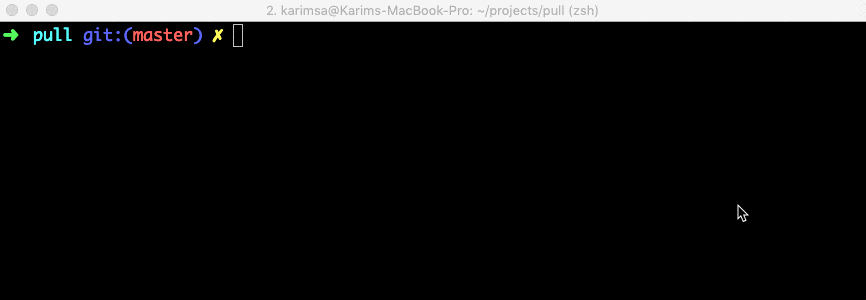

# @karimsa/pull

Download files using HTTP range transfers.



**Note on performance:** Downloading using ranges improves download performance but is network bound, not CPU bound. So depending on your network, you should set your own concurrency limit. The default is 2 * CPUs.

On my network, a 20MB file with `curl` downloads in ~20s. With a concurrency of 8, this goes down to 6-8s with `pull`.

## Usage

Install via npm - `npm install -g @karimsa/pull` or use via npx `npx @karimsa/pull`.

```bash
$ pull "http://mydomain.com/large-file.zip"
```

To see a help message, use `pull --help`.

## License

Licensed under MIT license.

Copyright &copy; 2019-present Karim Alibhai.
